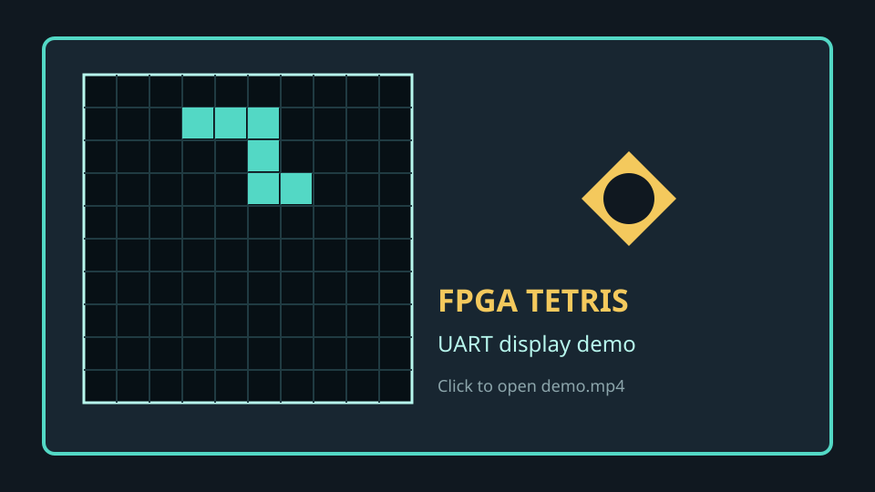

# FPGA Tetris Game with UART-Based PC Display

A hardware Tetris game implemented in Verilog for the **Gowin ACG525 Education Board**. The FPGA runs the game logic and streams the game board to a laptop over UART, where a Python viewer reconstructs and displays the game screen.

## Demo

[Open the demo video directly](video/demo.mp4)

## Hardware platform

- **Board:** Gowin ACG525 Education Board
- **FPGA clock:** 50 MHz
- **Controls:** Three active-low push buttons for left, right and rotate/enter
- **UART:** FPGA TX to the laptop at 115200 baud
- **I2C:** OLED display interface for the current difficulty level
- **Other outputs:** Buzzer for game events and a 7-segment display for the score

## Communication interfaces

### UART game-screen streaming

The FPGA sends the 10x20 game grid to the laptop periodically at about 30 frames per second. Each frame contains:

1. Two synchronization bytes: `0xAA 0x55`
2. 200 bytes of packed grid data (`1600` bits)
3. One XOR checksum byte

The Python viewer uses the sync header to find frame boundaries, verifies the checksum, unpacks the grid, and renders the board on the laptop. This keeps the laptop display separate from the real-time game logic running inside the FPGA.

### I2C OLED control

The I2C controller sends start, write and stop sequences to the OLED module. It is used to show the selected difficulty level locally on the board; it is not used for transferring the laptop game screen.

## Game logic

The main game controller in `src/game_logic.v` uses an **8-state FSM**:

- `S_GAME_MENU`: initialize and show the game menu
- `S_RENDER_NEW`: create the next render/update pass
- `S_RENDER_CHECK`: check the active brick and board collisions
- `S_BRICK_FALL`: advance the falling brick
- `S_BUTTON_HANDLE`: process player input
- `S_SAVE_MAP`: commit a brick to the board map
- `S_CLEAN_ROW`: detect and clear completed rows
- `S_GAME_OVER`: stop gameplay until a restart action

The UART frame sender has its own 3-state FSM (`IDLE`, `SEND`, `WAIT`) to serialize each frame without interrupting the game controller.

## Project contents

- `src/`: Verilog game logic, UART, I2C OLED, buzzer, seven-segment and constraints
- `game_viewer.py`: Python UART receiver and laptop display viewer
- `video/demo.mp4`: demonstration video
- `fpga_project_display.gprj`: Gowin project file

## Running the viewer

Run `game_viewer.py` on the laptop, select the COM port connected to the FPGA UART TX line, and start the FPGA design. The viewer will display validated game frames received over UART.
